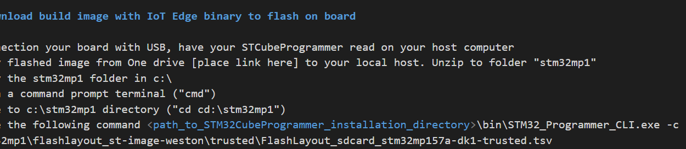

# Configure and deploy IoT Edge on STM32MP1 board

## Pre-requisites
* Azure account: 
    Bring your own Azure account to keep all your dev works. 
    or apply one for trial https://azure.microsoft.com/en-us/free/
* Install VS Code:
    https://code.visualstudio.com/download
* Install Azure IoT Explorer:
    https://github.com/Azure/azure-iot-explorer/releases. How to use: https://docs.microsoft.com/en-us/azure/iot-pnp/howto-use-iot-explorer
* Install extensiton for VS code
    Azure IoT tools: https://marketplace.visualstudio.com/items?itemName=vsciot-vscode.azure-iot-tools
    vsciot-vscode.azure-iot-edge
    vsciot-vscode.azure-iot-toolkit
    
## [Optional] Flash your board with OpenSTLinux images

### Ready your STM32MP1 board with USB connection 

### Download build image with IoT Edge binary to flash on board

1. Connection your board with USB, have your STCubeProgrammer read on your host computer 
2. Copy flashed image from One drive [place link here] to your local host. Unzip to folder "stm32mp1"
3. Copy the stm32mp1 folder in c:\
4. Open a command prompt terminal ("cmd")
5. Move to c:\stm32mp1 directory ("cd cd:\stm32mp1")
6. Type the following command <path_to_STM32CubeProgrammer_installation_directory>\bin\STM32_Programmer_CLI.exe -c port=usb1 -w c:\stm32mp1\flashlayout_st-image-weston\trusted\FlashLayout_sdcard_stm32mp157a-dk1-trusted.tsv

For example: 

"C:\Program Files (x86)\STMicroelectronics\STM32Cube\STM32CubeProgrammer\bin\STM32_Programmer_CLI.exe" -c port=usb1 -w c:\stm32mp1\flashlayout_st-image-weston\trusted\FlashLayout_sdcard_stm32mp157a-dk1-trusted.tsv

