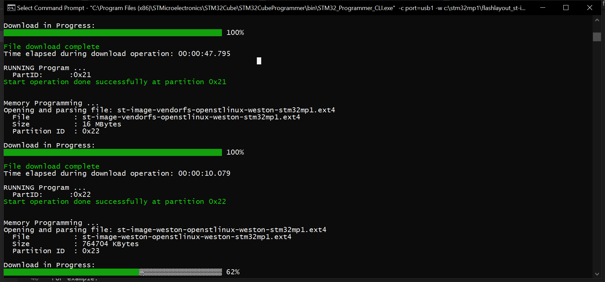
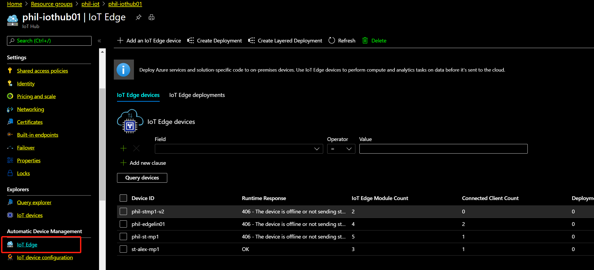
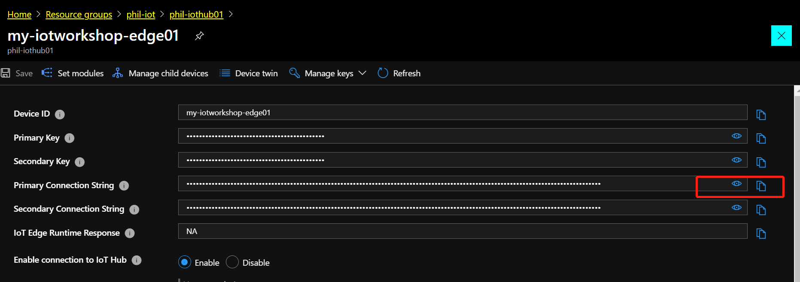
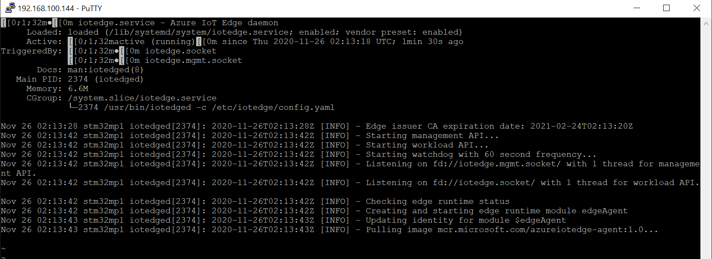

# Configure and deploy IoT Edge on STM32MP1 board

## Pre-requisites
* Azure account: 
    Bring your own Azure account to keep all your dev works. 
    or apply one for trial https://azure.microsoft.com/en-us/free/
* Install VS Code:
    https://code.visualstudio.com/download
* Install Azure IoT Explorer:
    https://github.com/Azure/azure-iot-explorer/releases. How to use: https://docs.microsoft.com/en-us/azure/iot-pnp/howto-use-iot-explorer
* Install extensiton for VS code
    Azure IoT tools: https://marketplace.visualstudio.com/items?itemName=vsciot-vscode.azure-iot-tools
    vsciot-vscode.azure-iot-edge
    vsciot-vscode.azure-iot-toolkit
    
## [Optional] Flash your board with OpenSTLinux images

### Ready your STM32MP1 board with USB connection 

### Download build image with IoT Edge binary to flash on board

1. Connection your board with USB, have your STCubeProgrammer read on your host computer 
2. Copy flashed image from One drive [place link here] to your local host. Unzip to folder "stm32mp1"
3. Copy the stm32mp1 folder in c:\
4. Open a command prompt terminal ("cmd")
5. Move to c:\stm32mp1 directory ("cd cd:\stm32mp1")
6. Type the following command <path_to_STM32CubeProgrammer_installation_directory>\bin\STM32_Programmer_CLI.exe -c port=usb1 -w c:\stm32mp1\flashlayout_st-image-weston\trusted\FlashLayout_sdcard_stm32mp157a-dk1-trusted.tsv

For example: 

"C:\Program Files (x86)\STMicroelectronics\STM32Cube\STM32CubeProgrammer\bin\STM32_Programmer_CLI.exe" -c port=usb1 -w c:\stm32mp1\flashlayout_st-image-weston\trusted\FlashLayout_sdcard_stm32mp157a-dk1-trusted.tsv

7. After completing flash, swith board to "on", restart it

## Configure IoT Hub and Edge on Azure Portal

### Create IoT Hub on Azure Portal 

1. Create IoT Hub. Ignore if you have your own Hub already. Follow below link. 
https://docs.microsoft.com/en-us/azure/iot-hub/iot-hub-create-through-portal?view=iotedge-2018-06

2. Register an IoT Edge device

Create a device identity for your IoT Edge device so that it can communicate with your IoT hub. The device identity lives in the cloud, and you use a unique device connection string to associate a physical device to a device identity.

[Azure Portal] Goes to your IOT Hub, click IoT Edge link in left hand navigator. Click "Add an IoT Edge Device" in top area. 

Input "Device ID": my-iotworkshop-edge01, click "Save".
Reclick the new edge "my-iotworkshop-edge01" created, copy the "primary connection string", save to your notepad to use later. 

### Connect your IoT Edge on board to cloud 

1. Switch your new flashed board to "on"

2. Connect your board to internet, either via Ethernet or Wifi dongle 

3. Network SSH or use Tera Term to terminal to connect to your board

PC> ssh root@your_board_ip_address

PC> cd /etc/iotedge

PC> cp ./config.yaml ./config.yaml.orig

4. Input the previous Edge connection string to config.yaml file below. Also modify hostname.

vi ./config.yaml

    -- # Manual provisioning configuration
    provisioning:
    source: "manual"
    device_connection_string: "<ADD DEVICE CONNECTION STRING HERE>"

        -- Sample connection string as below 
        HostName=yourhub.azure-devices.net;DeviceId=my-iotworkshop-edge01;SharedAccessKey=yourkey

    --###############################################################################

    hostname: "<ADD HOSTNAME HERE>"
    to, 
    hostname: "stm32mp1"

then, save config.yaml

5. Restart your edge to take effect 

PC> systemctl restart iotedge

It will take around 3 - 5 mins for yor edge to download firat IoT Edge module, edgeAgent

6. Some usful commands to check your edge status

systemctl status iotedge

iotedge list 

iotedge logs -f edgeAgent

